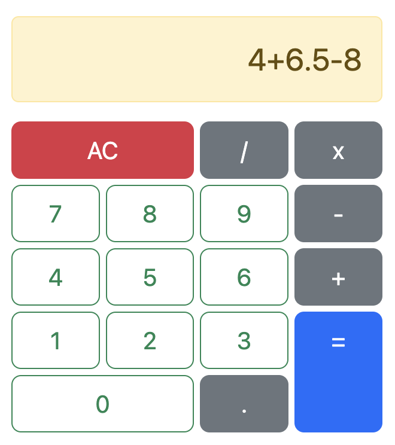

# Simple Calculator

This is a simple calculator that can perform basic arithmetic operations such as addition, subtraction, multiplication, and division. It supports whole numbers, decimals, and negative numbers. The calculator is designed to display the entire operation.

## Technologies Used

- HTML
- CSS
- Bootstrap
- JavaScript

## Usage

1. Clone the repository:

```bash
git clone https://github.com/katiaku/simple-calculator.git
```

2. Navigate to the project directory:

```bash
cd simple-calculator
```

3. Open the `index.html` file in a web browser.

## Preview



## Contributing

Contributions are welcome! If you find any issues or have suggestions for improvements, please open an issue or submit a pull request.
